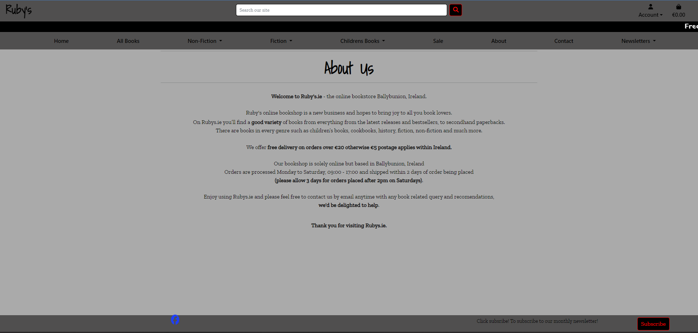

# _Rubys_
Rubys is an fictional online book store based in Ballybunion.

[_Click here to view live deployment_](https://rubys-97a7171770c1.herokuapp.com)

# _Content Menu_

- [Rubys](#rubys)
- [Content Menu](#content-menu)
- [Strategy Plane](#strategy-plane)
- [Scope Plane](#scope-plane)
- [Structure Plane](#structure-plane)
    - [Features](#features)
        - [Implemented Features](#implemented-features)
            - [Site Features](#site-features)
            - [Books](#books)
            - [Cart](#cart)
            - [Checkout](#checkout)
            - [User-Profile](#user-profiles)
            - [Administration](#administration)
            - [Messages](#messages)
            - [Favicon](#favicon)
            - [Errors](#errors)
        - [Features to be Implemented](#features-to-be-implemented)
- [Skeleton Plane](#skeleton-plane)
    - [Database](#design)
    - [WireFrames](#wireframes)
- [Surface Plane](#surface-plane)
    - [Design](#design)
    - [Colour And Style Scheme](#colour-and-style-scheme)
    - [Typography](#typography)
    - [Imagery](#imagery)
- [Bugs, Testing & Validation](#bugs,-testing-&-validation)
    - [Bugs](#bugs)
    - [Testing](#testing)
    - [Validation](#validation)
- [Technologies](#technologies)
- [Deployment](#deployment)
    - [1 - Version Control](#1---version-control)
    - [2 - Page Deployment](#2---page-deployment)
    - [3 - Cloning Repository](#3---cloning-repository)
- [Credits](#credits)

# **_Strategy Plane_**
* The project Consists of 9 main Epics

**EPIC 1** - Base Setup
* As a developer, I need to create the base.html and structure so all pages can use the same layout
* As a developer, I need to create static resources for all css and Images and JavaScript
* As a developer, I need to set up the project ready for implementing core features
* As a developer, I need to create the footer
* As a developer, I need to create the navbar sousers can navigate from any device

**EPIC 2** - Stand alone Pages
* As a developer, I need to implement a 404 error page
* As a developer, I need to implement a 500 error page
* As a developer, I need to implement a 403 error page

**EPIC 3** - Authentication
* As a developer, I need to implement allauth so that users can sign up and have access to the websites features
* As a site owner,  allauth pages to be customized to that they fit in with the sites styling

**EPIC 4** - Books
* As a user, I would like to be able to view books.
* As a user, I would like to be able to search books.
* As a user, I would like to add books to the cart.
* As a Admin user, I would like to add a books.
* As a Admin user, I would like to edit a books.
* As a Admin user, I would like to delete a books.

**EPIC 5** - Cart
* As a user,I would like to be able to add books to the cart
* As a user,I would like to be able to view the cart
* As a user,I would like to be able to remove books from the cart
* As a user,I would like to be able to update book quanties in thecart cart

**EPIC 6** - Checkout
* As a User,I would like to be able to securely checkout with books in the cart
* As a User,I would like to be able to have order confirmation displayed on screen.
* As a User,I would like to be able to have order confirmation emailed to my email.
* As a User,I would like to be able to complete an order with out creating an account.

**EPIC 7** - Profile
* As a User,I would like to be able to create a profile to save my orders.
* As a User,I would like to be able to create a profile to save my details for faster checkout on future purchases.
* As a User,I would like to be able to view orders that i have made.
* As a User,I would like to be able to view my details that i have saved to my profile.
* As a User,I would like to be able to edit my details that i have saved to my profile.

**EPIC 8** - Newsletters with Subscriptions
* As admin user i would like to create newsletters
* As admin user i would like to send newsletters to all subscribers
* As a user i would like to be able to subscribe to newsletters

**EPIC 9** - About/Contact
* As a user i would like to read about the company
* As a user i would like to be able to view contact details for company
* As a user i would like to be able to contact via the site

**EPIC 10** - Deployment
* As a developer, I need to deploy the project to heroku so that it is live for customer

**EPIC 11** - Documentation
* Complete readme documentation
* Complete testing documentation write up

**EPIC 12** - Marketing
* Marketing practises for the site like facebook page meta tags for goolge and a site map

# **_Scope Plane_**
* Fully responsive Design that will function on all device off 320px and up.
* Hamburger with offcanvus menu for mobile devices.
* Full CRUD functionality on Books and Orders.
* Restricted role for different user types features.

# **_Structure Plane_**
## **_Features_**
### **_Implemented Features_**
#### **Site Features**
##### **Home Page**

* The home page is simple with a carousell of sale books a small bit of text and a subcribe form for users to subscribe to monthly news letters.

* On mobile device the sale carousell moves below the text.

##### **Header**
###### **Header Styling**
* The nav bar is a medium shade of grey with black text,

###### **Medium Screens and Above**
* The top navbar has the logo to the left, A search bar feature allowing the user to books on the site centered, and to the left is accont dropdown men and the shopping cart link with the cart total.
* Then there is a black banner with white text that scrolls displaying about free delivery annd red tag sale.
* Then there is a bottom navbar with links to the home page, all books, book genres, about page, contact page, and the newsletters page.

###### **Mobile to Medium Screens**
* The black banner with white text that scrolls displaying about free delivery annd red tag sale is displayed on top.
* Then navbar is displayed next a hamburger men that displays off canvas, The Logo is centered and on the left is the shopping cart link with the cart total.
* Then the search bar is below the main navbar allowing the user to books on the site
* The off canvas menu has navigation links to the he home page, all books, book genres, about page, contact page, and the newsletters page.

##### **Footer**
* The footer is a medium shade of grey with black text.

###### **Medium Screens Plus**
* Has Links to Rubys Facebook page to the left.
* Has a button to allow users to subscride to monthly newsletters to the right.

###### **Mobile to Medium Screens**
* Has Links to Rubys Facebook page centered on top.
* Then has text for monthly newsletter subscription.
* Then at the bottom there is button to allow users to subscride.
* At Bootstraps sm screen size the monthly subscription text and buttom move side by side and the facebook link moves to the left.

#### **Books**
##### **All Books**
###### **Medium Screens Plus**

* Has the page title with sorting functions below on one line.
* the book cards move side by side as the screen size gets larger.

###### **Mobile to Medium Screens**

* Has the page title with sorting functions below on two line.
* the book cards move side by side as the screen size gets larger from a single card on mobile devices.

##### **Single Book View**
###### **Medium Screens Plus**

###### **Mobile to Medium Screens**

##### **Add Book**
###### **Medium Screens Plus**

###### **Mobile to Medium Screens**

##### **Edit Book**
###### **Medium Screens Plus**

###### **Mobile to Medium Screens**

##### **Delete Book**
###### **Medium Screens Plus**

###### **Mobile to Medium Screens**

#### **Cart**
##### **Medium Screens Plus**

##### **Mobile To Medium Screens**

#### **Checkout**
##### **Checkout View**
###### **Medium Screens Plus**

###### **Mobile To Medium Screens**
checkout-loading-overlay

###### **Checkout Loading Overlay**

##### **Checkout Success and Overview**
###### **Medium Screens Plus**

###### **Mobile To Medium Screens**

#### **User Profiles**
##### **Main Profile**
###### **Medium Screens Plus**

###### **Mobile To Medium Screens**

##### **User Update Details View**
###### **Medium Screens Plus**

###### **Mobile To Medium Screens**

#### **About and Contact**
##### **About**
###### **Medium Screens Plus**

###### **Mobile To Medium Screens**

##### **Contact**
###### **Medium Screens Plus**

###### **Mobile To Medium Screens**

#### **Subscribe**
##### **Medium Screens Plus**

##### **Mobile To Medium Screens**

#### **Newsletters**
##### **All Newsletters**

##### **Single Newsletters**

##### **Add Newsletters**

#### **Administration**
##### **Book Management**
###### **Medium Screens Plus**

###### **Mobile To Medium Screens**

##### **All Site Orders**

* To be implemented for use for admin users to view all orders made with the ability to search them.

#### **Messages** (Toasts)
##### **Medium Screens Plus**

#### **Favicon**
* A favicon was implemented to Show the user that They still are pressent on site
* This also provides an image in the tabs to allow the user to easily identify the website if they have multiple tabs open.

#### **Errors**
##### **403 Error**
* A 403 error page has been implemented to provide feedback to the user when they try to access unauthorized content or actions.
* This covers the actions of adding, updating and deleting of content for all users except those how are admin users.

##### **404 Error**
* A 404 error page has been implemented to provide feedback to the user if they try to open a page that does not exist.

##### **500 Error**
* A 500 error page has been implemented to provide feedback to the user that the server has encounted a problem.  

### **_Features to be Implemented_**

* Add a order history page for admin users.
* Make the newsletters more editable and more options to create more user freindly and appealing newsletters to the customers for better marketing.

# **_Skeleton Plane_**
## **_Database_**
* This shows the schemas for each of the models and how they are related.
* Entity relationship diagram was created using [DBVisualizer](https://www.dbvis.com/)

## **_WireFrames_**

# ** _Surface Plane_**
## **_Design_**
### _Colour And Style Scheme_
Colour used within the site.
* Fade to cover background image: #aaaaaae0; 
* Main background: #aaaaaa;
* Black background: #000000;
* Card Backgrond: #d3d0d0;
* Navbar and footer: #504f4f;
* Off canavs background: #ffffff;
* Red tag*: #fa0000;
* Hover color: #ff0000;
* Black text: #000000;
* White text: #ffffff;
* Stripe payment overlay: #ff04048f;
* To clear background colour on the sort buttons: #ffffff00;
* Sort Button Hover Color: #9c9c9c;

### **_Typography_**
* Fonts imported from google fonts with buck up fonts if not supported by browsers
* The logo: 'Shadows Into Light', serif;
* The delivery Banner: 'Yatra One', serif;
* All headers: 'Shadows Into Light', serif;
* All text: 'Zilla Slab', serif, arial;

### **_Imagery_**
* The Logo is 'Shadows Into Light' font just as black text.
* The Background image is ai generated from [_Craiyon.com_](https://www.craiyon.com/)

# **_Bugs, Testing & Validation_**
* For Bugs, Testing & Validation. with results click the link below to navigate to the testing md file (This is separate to reduce the readme file size)
[TESTING.md](TESTING.md)

# **_Technologies_**
### **Python/ Django**
* Python is the main proggraming language whilst using the django framework.
### **HTML**
* Used to for main website language.
### **CSS**
* For the styling for the website.
### **Bootstarp 5.2.3**
* Is used With in the site for different styling and for responsiveness.
### **[Font Awesome](https://fontawesome.com/)**
* Used for difrerent icons through out the site.
### **Git**
* Used to commit and push through out the development.
### **[balsamiq](https://balsamiq.com/)**
* Wireframes were created using balsamiq.
### **[TinyPNG](https://tinypng.com/)**
* Was used to compress the background image 
### **[cloudconvert](https://cloudconvert.com/webp-converter,)**
* Was used to change image files to webp.
### **[ElephantSQL](https://www.elephantsql.com/)**
* To store the site data.  ElephantSQL is a ProsgreSQL based database.
### **[Cloudinary](https://cloudinary.com/)**
* Was used For the storage of static file and images.
### **[favicon](https://favicon.io/favicon-generator/)**
* Favicon.io was used to generate the favicon.
### **[DBVisualizer](https://www.dbvis.com/)**
* Was used to create the flow chart showing the database relationships.
### **[GitHub](https://www.github.com)**
* Is the main repository site files.
### **[Gitpod](https://www.gitpod.io)**
* Was the main the coding environment.
### **[Heroku](https://www.heroku.com)**
* Is used to deploy the website to the web.
### **[Techsini.com](https://techsini.com/multi-mockup/index.php)**
* Is used to create the mockup image for the readme.

# **_Deployment_**
## **_Version Control_**
* Verion controle was maintained using GIT within GitPod to push code to the GitHub repository
* From the Gitpod terminal use "git add ." which tells git you would like to make changes/updates to the files.
* Then use "git commit -m " with a comment, this will commit the changes and update the files.
* Then using the "git push" command this will push the committed changes to your GitHub repository.

## **_Page Deployment_**
* Go to Heroku and log in
* Click "New" to create a new app from the dashboard
* Choose app name and select your region, press "Create app".
* Go to "Settings" and navigate to Config Vars.
* Add Config Vars. 
    This app used 10 confid vars 
    * Clouninary (KEY: CLOUNDINARY_URL / VALUE: *****)
    * Database (KEY: DATABASE_URL / VALUE: ******)
    * Secret key: (KEY: SECRET_KEY / VALUE:*******)
    * Development: (KEY: DEVELOPMENT / VALUE: True)
    * Stripe: - Public key : (KEY: STRIPE_PUBLIC_KEY / VALUE: ******)
              - Secret Key: (KEY: STRIPE_SECRET_KEY / VALUE: ******)
              - Webhook secret: (KEY: STRIPE_WH_SECRET / VALUE: ******)
    * Django emails: - Host User:(KEY: EMAIL_USER / VALUE: ******)
                     - From User:(KEY: EMAIL_FROM_USER / VALUE: ******)
                     - Host Password:(KEY: EMAIL_PASS / VALUE: ******)
    (Django emails is set to use gmail (EMAIL_HOST = 'smtp.gmail.com'))
* Now go to the Deploy tab.
* Scroll Down to Deployment Method and select GitHub.
*  Select repository to be deployed and connect to Heroku.
* Now Scroll down to depoly : 
    * Option 1 is selecting Automatic deploys (Will Update Automaticly when every git push to the repository).
    * Option 2 is selecting Manual deploy (Needs to be redeployed after every change manually via Heroku deploy tab).

Visit the live deployment [HERE](https://rubys-97a7171770c1.herokuapp.com).

## **_Cloning Repository_**
* To clone the repository for download or use within your GitHub head-over to this [link](https://github.com/git-guides/git-clone) 

# **_Credits_**
* I used [python.org](https://www.python.org/) for References for the Pyhton code and functionality.

* I used [w3schools](https://www.w3schools.com/python/default.asp) for References for the Pyhton code and functionality.

* I used [bootstrap V5.2.3](https://getbootstrap.com/) for References for the bootstrap styling and functionality.

* I used [stackoverflow](https://stackoverflow.com/) for References for the Pyhton code and functionality.

* I Used [Django Docs](https://docs.djangoproject.com/en/5.0/) to the reference for the django code and functionality.

* I Used the Code Institute Project - Boutique Ado as a base and used the JavaScript funtionalility with in the site.