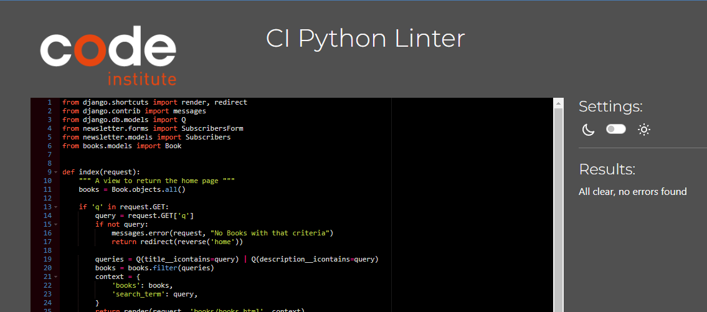

# _Test Menu_

- [Test Menu](#test-menu)
- [Functional Testing](#functional-testing)
    - [Authentication](#authentication)
    - [Profile](#profiles)
    - [Books](#books)
    - [Book Management](#book-management)
    - [Shooping Cart](#shopping-cart)
    - [Checkout](#checkout)
    - [About](#about)
    - [Contact](#contact)
    - [Newsletters](#newsletters)
    - [Subscribe](#subscribe)
    - [Navigation](#navigation)
    - [Footer](#footer)
- [Bugs](#structure-plane)
- [Validation](#features)
    - [PEP8 Valadator](#implemented-features)
    - [W3 Valadator](#site-features)
    - [Lighthouse Report](#home-page)
- [Responsiveness](#header)
## _Functional Testing_

### _Authentication_
#### 1 **Registration**
***Description***:

A user can sign up to the website.

***Steps***:
1. Navigate to [_Ruby's_](https://rubys-97a7171770c1.herokuapp.com/) go to  the account menu and click Register.
2. Enter email, username and password.
3. Click Sign Up Button.

***Expected***:

After clicking on the "Sign Up" button registration is successful, User is redirected to the home page.

***Actual***:

Clicking on the "Sign Up" button registration is successful, User is redirected to the home page.

#### 2 **Sign In**
***Description***:

A user can sign in to the website

***Steps***:
1. Navigate to [_Ruby's_](https://rubys-97a7171770c1.herokuapp.com/) go to  the account menu and click Login.
2. Enter email or username and password.
3. Click Sign In button.

***Expected***:

After clicking on the "Sign In" button user is signed in and redirected to the home page.

***Actual***: 

Clicking on the "Sign In" button user is signed in and redirected to the home page.

#### 3 **Sign Out**
***Description***:

A user can sign out of the website

***Steps***:
1. Navigate to [_Ruby's_](https://rubys-97a7171770c1.herokuapp.com/) go to the account menu and click Sign Out.
2. Click confirm on the confirm logout page.

***Expected***:

After clicking on the "Sign Out" Link user is redirected to confirm logout page, Click the Confirm button and the user is logged out and redirected to the home page.

***Actual***: 

Clicking on the "Sign Out" Link user is redirected to confirm logout page, Clicking the Confirm button and the user is logged out and redirected to the home page.

### _Profile_

#### 1 **Navigate to Profile**
***Description***:

A user can navigate to profile section fo site

***Steps***:
1. Navigate to [_Ruby's_](https://rubys-97a7171770c1.herokuapp.com/) go to the account menu and click Login.
2. Enter email or username and password.
3. Click Sign In button.
4. Go to the account menu and click My Profile.

***Expected***:

User is directed to the users profile page.

***Actual***: 

The user is directed to the profile page.

#### 2 **Profile View previous Orders**
***Description***:

A user can view previous orders

***Steps***:
1. Navigate to [_Ruby's_](https://rubys-97a7171770c1.herokuapp.com/) go to the account menu and click Login.
2. Enter email or username and password.
3. Click Sign In button.
4. Go to the account menu and click My Profile.
5. Click on previous order to open

***Expected***:

User is directed to the order details to view.

***Actual***: 

The user is directed to the order details view.

#### 3 **Profile Update User Details**
***Description***:

A user can update there details that are saved.

***Steps***:
1. Navigate to [_Ruby's_](https://rubys-97a7171770c1.herokuapp.com/) go to the account menu and click Login.
2. Enter email or username and password.
3. Click Sign In button.
4. Go to the account menu and click My Profile.
5. Click on update details button.  
6. Update desired details
7. Click Update Information button.

***Expected***:

User is directed to the personal details view.
After details have been updated and update information button is clicked the user is displayed message saying "Your details was successsfully updated".

***Actual***: 

User is directed to the personal details view.
After details have been updated and update information button has been clicked the user is displayed message saying "Your details was successsfully updated".

### _Books_
#### 1 **All Books Shown**
***Description***:

All books view displaying all books.

***Steps***:
1. Navigate to [_Ruby's_](https://rubys-97a7171770c1.herokuapp.com/).
2. Click on All Books in the navbar.

***Expected***:

All Books Show as titles.

***Actual***:

All Books Show as titles.

#### 2 **Single Book View**
***Description***:

Displaying a single book view

***Steps***:
1. Navigate to [_Ruby's_](https://rubys-97a7171770c1.herokuapp.com/)
2. Click on All Books in the navbar.
3. Click on a book.

***Expected***:

The book selected opens to a single view displaying all information.

***Actual***:

The book selected opens the single view displaying all information.

#### 3 **Book Search**
***Description***:

Searching for desiered books

***Steps***:
1. Navigate to [_Ruby's_](https://rubys-97a7171770c1.herokuapp.com/).
2. Click on All Books in the navbar.
3. In the search bar add details of search eg: "cooking book" or "dolls"
4. Click in the search icon button

***Expected***:

The items containing the search criteria is filtered and dispalyed.

***Actual***:

The items containing the search criteria is filtered and dispalyed.

#### 4 **Book Sort Price**
***Description***:

Sorting books via price.

***Steps***:
1. Navigate to [_Ruby's_](https://rubys-97a7171770c1.herokuapp.com/).
2. Click on All Books in the navbar.
3. Click on the Price arrow up icon.
4. Click on the Price arrow down icon.

***Expected***:

When the price arrow up is pressed the books are ordered lowest price first
When the price arrow down is pressed the books are ordered highest price first.

***Actual***:

When the price arrow up is pressed the books are ordered lowest price first
When the price arrow down is pressed the books are ordered highest price first.

#### 5 **Book Sort Rating**
***Description***:

Sorting books via rating.

***Steps***:
1. Navigate to [_Ruby's_](https://rubys-97a7171770c1.herokuapp.com/).
2. Click on All Books in the navbar.
3. Click on the Rating arrow up icon.
4. Click on the Rating arrow down icon.

***Expected***:

When the rating arrow up is pressed the books are ordered lowest rating first
When the rating arrow down is pressed the books are ordered highest rating first.

***Actual***:

When the rating arrow up is pressed the books are ordered lowest rating first
When the rating arrow down is pressed the books are ordered highest rating first.

#### 6 **Book Sort Author**
***Description***:

Sorting books via author.

***Steps***:
1. Navigate to [_Ruby's_](https://rubys-97a7171770c1.herokuapp.com/).
2. Click on All Books in the navbar.
3. Click on the Author arrow up icon.
4. Click on the Author arrow down icon.

***Expected***:

When the author arrow up is pressed the books are ordered alphabetically starting with a first.
When the author arrow down is pressed the books are ordered alphabetically starting with z first.

***Actual***:

When the author arrow up is pressed the books are ordered alphabetically starting with a first.
When the author arrow down is pressed the books are ordered alphabetically starting with z first.

#### 7 **Book Sort Title**
***Description***:

Sorting books via title.

***Steps***:
1. Navigate to [_Ruby's_](https://rubys-97a7171770c1.herokuapp.com/).
2. Click on All Books in the navbar.
3. Click on the Title arrow up icon.
4. Click on the Title arrow down icon.

***Expected***:

When the title arrow up is pressed the books are ordered alphabetically starting with a first.
When the title arrow down is pressed the books are ordered alphabetically starting with z first.

***Actual***:

When the title arrow up is pressed the books are ordered alphabetically starting with a first.
When the title arrow down is pressed the books are ordered alphabetically starting with z first.

#### 8 **Book Sort Category**
***Description***:

Sorting books via category.

***Steps***:
1. Navigate to [_Ruby's_](https://rubys-97a7171770c1.herokuapp.com/).
2. Click on All Books in the navbar.
3. Click on the Category arrow up icon.
4. Click on the Category arrow down icon.

***Expected***:

When the category arrow up is pressed the books are ordered alphabetically starting with a first.
When the category arrow down is pressed the books are ordered alphabetically starting with z first.

***Actual***:

When the category arrow up is pressed the books are ordered alphabetically starting with a first.
When the category arrow down is pressed the books are ordered alphabetically starting with z first.

### _Book Management_
#### 1 **Book Management View**
***Description***:

As admin open book management view

***Steps***:
1. Navigate to [_Ruby's_](https://rubys-97a7171770c1.herokuapp.com/).
2. Login as Admin User.
3. Click on Account And then Book Management

***Expected***:

Rediected to the book management page view.

***Actual***:

Rediected to the book management page view.

#### 2 **Book Management Book Edit**
***Description***:

As Admin books can be edited

***Steps***:
1. Navigate to [_Ruby's_](https://rubys-97a7171770c1.herokuapp.com/).
2. Login as Admin User.
3. Find Book to be edited.
4. Click on edit
5. Update information.
6. Click Update Book

***Expected***:

Admin User is directed to the edit book view.
When Update Book button is clicked the admin user is directed to the single book view with message saying "'Book title will be here' was successfully updated!".

***Actual***: 

Admin User is directed to the edit book view.
When Update Book button is clicked the admin user is directed to the single book view with message saying "'Book title will be here' was successfully updated!".

#### 3 **Book Management Book Delete**
***Description***:

As Admin books can be deleted

***Steps***:
1. Navigate to [_Ruby's_](https://rubys-97a7171770c1.herokuapp.com/).
2. Login as Admin User.
3. Find Book to be deleted.
4. Click on deleted
5. Confirm deletion page is show.
6. Click Confirm

***Expected***:

When admin user clicks delete the delete confirmation page is shown
and when confirm is clicked the admin user is redirected to the all book view displaying a message saying "'Book title will be here' was successfully deleted".

***Actual***: 
When admin user clicks delete the delet confirmation page is shown
and when confirm is clicked the admin user is redirected to the all book view displaying a message saying "'Book title will be here' was successfully deleted".

#### 4 **Book Management Add Book**
***Description***:

As Admin books can be Added

***Steps***:
1. Navigate to [_Ruby's_](https://rubys-97a7171770c1.herokuapp.com/).
2. Login as Admin User.
3. Click on Account And then Book Management.
4. Click on Add New Book.
5. Enter Book information on the add book page.
6. Click Add Book.

***Expected***:

When admin user clicks add book, the add book page is shown, and once the book information if filled in and the add book button is clicked the user is directed to the all book page displaying a message saying "'Book title will be here' was successfully added".

***Actual***:

When admin user clicks add book, the add book page is shown, and once the book information if filled in and the add book button is clicked the user is directed to the all book page displaying a message saying "'Book title will be here' was successfully added".

### _Shooping Cart_
#### 1 **Add Book To Cart**

***Description***:

Adding items to cart.

***Steps***:
1. Navigate to [_Ruby's_](https://rubys-97a7171770c1.herokuapp.com/).
2. Click on All Books in the navbar.
3. Click on a book.
4. Click on the Add To Cart button

***Expected***:

The book is added to the cart with a message display of the cart shown on the left when the item is added.

***Actual***:

The book is added to the cart with a message display of the cart shown on the left after the item is added.

#### 2 **View Shopping Cart**
***Description***:

Viewing the Shopping cart

***Steps***:
1. Navigate to [_Ruby's_](https://rubys-97a7171770c1.herokuapp.com/).
2. Click on the shopping cart icon in the top navbar.

***Expected***:

When the shopping cart icon is clicked then the user is redirected to the shopping cart page.
    if there is nothing in the cart the user is displayed a message saying "Your cart is empty." and a button keep shopping.
    if there is items in the shopping cart then these items will display with options for updating amounts and removing. with the over all costings being displayed.

***Actual***:

When the shopping cart icon is clicked then the user is redirected to the shopping cart page.
    When nothing is in the cart the user is displayed a message saying "Your cart is empty." and a button keep shopping.
    When there is items in the shopping cart the items are display with the options for updating amounts and removing. with the over all costings being displayed.

 

#### 3 **Update Items In The Shopping Cart**
***Description***:

Updating the quantities of items in the Shopping cart

***Steps***:
1. Navigate to [_Ruby's_](https://rubys-97a7171770c1.herokuapp.com/).
2. Click on a book.
3. Click on the Add To Cart button
4. Click on the shopping cart icon in the top navbar.
5. Click on the plus button to increase the quantity.
6. Click on the update Button
5. Click on the minus button to decrease the quantity.
6. Click on the update Button

***Expected***:

when a quantity is increased the overal prices are updated accordinaly.
when a quantity is deincreased the overal prices are updated accordinaly.

***Actual***:

when the quantity is increased the overal prices are updated accordinaly.
when the quantity is deincreased the overal prices are updated accordinaly.

#### 4 **Remove Item From The Shopping Cart**
***Description***:

Removing items From the Shopping cart

***Steps***:
1. Navigate to [_Ruby's_](https://rubys-97a7171770c1.herokuapp.com/).
2. Click on a book.
3. Click on the Add To Cart button
4. Click on the shopping cart icon in the top navbar.
5. Click on the remove button.

***Expected***:

when the item is removed, the overal prices are updated accordinaly.

***Actual***:

when the item is removed, the overal prices are updated accordinaly.

### _Checkout_
#### 1 **Proceeding to Checkout**

***Description***:

Checking out items in the shopping cart

***Steps***:
1. Navigate to [_Ruby's_](https://rubys-97a7171770c1.herokuapp.com/).
2. Click on All Books in the navbar.
3. Click on a book.
4. Click on the Add To Cart button.
5. Click on the Shopping cart icon.
6. Click on Secure Checkout.

***Expected***:

The user is directed to the checkout view

***Actual***:

The user is directed to the checkout view

#### 2 **Completing Checkout Process**

***Description***:

Completing Checkout Process.

***Steps***:
1. Navigate to [_Ruby's_](https://rubys-97a7171770c1.herokuapp.com/).
2. Click on All Books in the navbar.
3. Click on a book.
4. Click on the Add To Cart button.
5. Click on the Shopping cart icon.
6. Click on Secure Checkout.
7. Fill out Details needed for checkout.
8. Click Complete Order

***Expected***:

The user is directed to the checkout view. once the details are filled and complete order is click the user will see a red overlay screem with a loading spinner and then redirected to the successful checkout view.
email sent to user.

***Actual***:

The user is directed to the checkout view. once the details are filled and complete order is click the user will see a red overlay screem with a loading spinner and then redirected to the successful checkout view.
email does not send.

### _About_
#### 1 **About View**
***Description***:

Opening the about view

***Steps***:
1. Navigate to [_Ruby's_](https://rubys-97a7171770c1.herokuapp.com/).
2. Click on about

***Expected***:

Rediected to the about page view.

***Actual***:

Rediected to the about page view.

### _Contact_
#### 2 **Contact View**
***Description***:

Opening the Contact view

***Steps***:
1. Navigate to [_Ruby's_](https://rubys-97a7171770c1.herokuapp.com/).
2. Click on Contact

***Expected***:

Rediected to the Contact page view.

***Actual***:

Rediected to the Contact page view.

#### 2 **Contact Send Enquiry**
***Description***:

Sending Enquiry

***Steps***:
1. Navigate to [_Ruby's_](https://rubys-97a7171770c1.herokuapp.com/).
2. Click on Contact.
3. Fill Out the enquiry form.
4. Click Send.

***Expected***:

When Form is Filled Out and send it pressed, user is displaed a message saying "Thank you 'Users Name is here', We have recived your email and will be in touch soon".
email is sent to the email account linked to the django email.

***Actual***:

When Form is Filled Out and send it pressed, user is displaed a message saying "Thank you 'Users Name is here', We have recived your email and will be in touch soon".
email is sent to the email account linked to the django email.

### _Newsletters_
#### 1 **All Newsletters Shown**
***Description***:

All Newsletters view, displaying all Newsletters.

***Steps***:
1. Navigate to [_Ruby's_](https://rubys-97a7171770c1.herokuapp.com/).
2. Login As Admin.
3. Click on Newsletters in the navbar and then newsletters again.

***Expected***:

All Newsletters are Show as titles.

***Actual***:

All Newsletters are Show as titles.

#### 2 **Single Newsletter View**
***Description***:

Displaying a single Newsletter view

***Steps***:
1. Navigate to [_Ruby's_](https://rubys-97a7171770c1.herokuapp.com/)
2. Login As Admin.
3. Click on Newsletters in the navbar and then newsletters again.
4. Click on desired newsletter.

***Expected***:

The newsletter selected opens to a single view displaying all information.

***Actual***:

The newsletter selected opens the single view displaying all information.

#### 3 **New Newsletter**
***Description***:

Creating a new newsletter

***Steps***:
1. Navigate to [_Ruby's_](https://rubys-97a7171770c1.herokuapp.com/)
2. Login As Admin.
3. Click on Newsletters.
4. Click on New Newsletter.
5. Create Newsletter.
6. Click Send Newsletter.

***Expected***:

Once the admin user has created a new newsletter and clicks send the newsletter is emailed to all subscribers. and the admin user is redirected to the all newsletter view.

***Actual***:

Once the admin user has created a new newsletter and clicks send the newsletter is emailed to all subscribers. and the admin user is redirected to the all newsletter view.

### _Subscribe_
#### 1 **Subscribe View**
***Description***:

Subscribe view, displaying newest newsletter and way to subscribe.

***Steps***:
1. Navigate to [_Ruby's_](https://rubys-97a7171770c1.herokuapp.com/).
2. Click on Subscribe in the footer.

***Expected***:

Subscribe view is displayed with the latest newsletter.

***Actual***:

Subscribe view is displayed with the latest newsletter.

#### 2 **Subscribe**
***Description***:

Subscribe for the monthly newsletter.

***Steps***:
1. Navigate to [_Ruby's_](https://rubys-97a7171770c1.herokuapp.com/).
2. Click on Subscribe in the footer.
3. Enter Email address.
4. Click subscribe.

***Expected***:

When email address is provided and the Subscribe is clicked the user will be displayed the message "Subscription Successful".

***Actual***:

When email address is provided and the Subscribe is clicked the user will be displayed the message "Subscription Successful".

### _Footer_

Testing was performed on the footer link and Button

- When Clicking the Facebook icon and ensuring that the link opens Ruby's Facebookp page in a new tab. This behaved as expected.
- When Clicking the Subscribe button ensuring it opens up the subscription page.

## _Bugs_

After Testing the site there does not appeart to be any faults with the functions of the site main features.
whit that in mind the only minor bug that can be seen at pressent is the messages outputed to the user after updating items with out redirecting are only shown when the page is reloaded.
    
## _Validation_

### PEP8 Valadator

All file passed through the [Code Institute PEP8](https://pep8ci.herokuapp.com/) Validator after removing a few white spaces and Shortening a few line lenghts.

There are a couple of exceptions for a couple of lines in the settings.py and webhook_handeler.py files with shortening these cause errors with in the project.

### W3 Valadator

The site passed through W3 Valadator with just a few minor errors on carousel ids as they had same name, so after remaning them it passed.

### Lighthouse Report

Lighthouse report has shown areas to be improved. with the over all scores are 90 and above. 

## Responsiveness

All pages have been tested to ensure responsiveness on screen sizes from 320px and upwards for responsive design on Chrome, Edge, browsers.

Steps to test:

- Open Chrome and navigate to [_Ruby's_](https://rubys-97a7171770c1.herokuapp.com/)
- Open the developer tools 
- Set to responsive
- Click and drag the responsive window to from 320px to maximum width

Expected:

Website is responsive on all screen sizes.

Actual:

Website behaved as expected.

Website was also opened on the following devices and no responsive issues were seen:

Samsung S23
IPhone 13